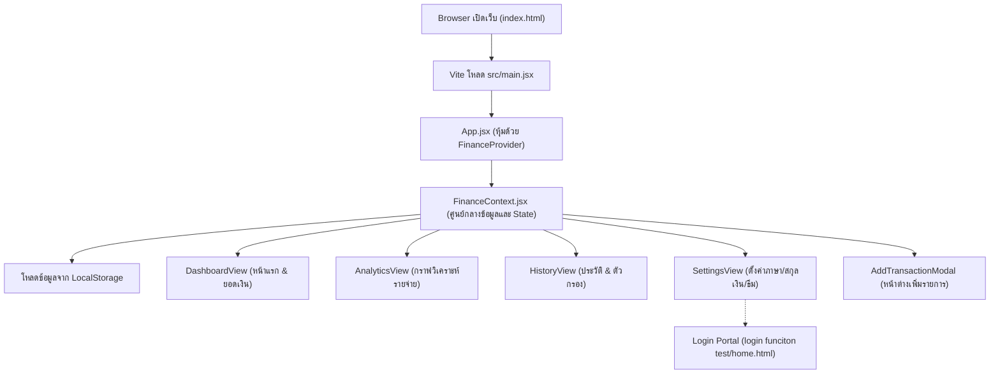

# 📘 คู่มืออธิบายระบบและเครื่องมือทั้งหมดในโปรเจกต์ MoneyDairy
> **(MoneyDairy Project Architecture & Technology Guide - ภาษาไทย)**  
> จัดทำขึ้นเป็นพิเศษเพื่อให้เข้าใจง่าย เหมาะสำหรับผู้ที่กำลังเริ่มต้นศึกษาและพัฒนาสู่การเป็น **Fullstack Web Developer**

---

## 📑 สารบัญ (Table of Contents)
1. [ภาพรวมของโปรเจกต์ (Project Overview)](#1-ภาพรวมของโปรเจกต์-project-overview)
2. [ระบบทำงานอย่างไร? (How the System Works)](#2-ระบบทำงานอย่างไร-how-the-system-works)
3. [ตอบคำถามและอธิบายเครื่องมือสำคัญ (Tools & Terms FAQ)](#3-ตอบคำถามและอธิบายเครื่องมือสำคัญ-tools--terms-faq)
   - [Vite คืออะไร? ทำไมถึงต้องใช้?](#-31-vite-คืออะไร-ทำไมถึงต้องใช้)
   - [คำสั่ง echo คืออะไร?](#-32-คำสั่ง-echo-คืออะไร)
   - [ไฟล์ .jsx คืออะไร? (และคำว่า .lsx / .tsx)](#-33-ไฟล์-jsx-คืออะไร-และคำว่า-lsx--tsx)
   - [React คืออะไร? และ Hooks ที่ใช้ในโปรเจกต์](#-34-react-คืออะไร-และ-hooks-ที่ใช้ในโปรเจกต์)
   - [Tailwind CSS และ PostCSS คืออะไร?](#-35-tailwind-css-และ-postcss-คืออะไร)
   - [Git คำสั่งต่างๆ ที่พบบ่อย (cherry-pick, reflog, checkout)](#-36-git-คำสั่งสำคัญที่เห็นใน-terminal)
   - [ไฟล์ .env และ .gitignore คืออะไร?](#-37-ไฟล์-env-และ-gitignore-คืออะไร)
   - [ไลบรารีเสริม: Lucide Icons และ Canvas Confetti](#-38-ไลบรารีเสริมที่ใช้ในโปรเจกต์)
4. [โครงสร้างไฟล์ทั้งหมดในโปรเจกต์ (Folder & File Structure)](#4-โครงสร้างไฟล์ทั้งหมดในโปรเจกต์-folder--file-structure)
5. [วิธีรันและทดสอบโปรเจกต์ (How to Run & Test)](#5-วิธีรันและทดสอบโปรเจกต์-how-to-run--test)

---

## 1. ภาพรวมของโปรเจกต์ (Project Overview)

โปรเจกต์นี้มีชื่อว่า **"MoneyDairy"** (สมุดบันทึกรายรับ-รายจ่ายส่วนบุคคล) ออกแบบในสไตล์ **Modern Fintech App**:
- **วัตถุประสงค์หลัก**: ช่วยให้ผู้ใช้สามารถบันทึกรายรับ-รายจ่าย, ดูรายงานกราฟวิเคราะห์ทางการเงิน (Analytics), ค้นหาประวัติย้อนหลัง (History), และตั้งค่าความปลอดภัย/ความเป็นส่วนตัว
- **จุดเด่นพิเศษ**:
  - รองรับ **3 ภาษา**: 🇱🇦 ภาษาลาว (Lao), 🇺🇸 ภาษาอังกฤษ (English), 🇻🇳 ภาษาเวียดนาม (Vietnamese)
  - รองรับ **4 สกุลเงิน**: ₭ LAK (กีบ), ฿ THB (บาท), $ USD (ดอลลาร์), ₫ VND (ดง) พร้อมระบบคำนวณอัตราแลกเปลี่ยนอัตโนมัติ
  - รองรับ **Dark Mode / Light Mode** สลับโทนสีมืดและสว่าง
  - มีระบบ **Privacy Mode (Hide Balance)** ซ่อนตัวเลขเงินในที่สาธารณะ
  - มีระบบ **Authentication & Login Portal** (หน้าล็อกอิน, สมัครสมาชิก, จำลองสแกนใบหน้า FaceID)

---

## 2. ระบบทำงานอย่างไร? (How the System Works)

แอปพลิเคชันนี้ทำงานในรูปแบบ **Single Page Application (SPA)** โดยใช้ React:



### ขั้นตอนการทำงานทีละสเต็ป:
1. **การโหลดหน้าเว็บเริ่มต้น**:
   - เบราว์เซอร์เปิดไฟล์ `index.html` ซึ่งจะไปเรียกสคริปต์ `src/main.jsx`
   - `main.jsx` ทำการ Render คอมโพเนนต์ `<App />` เข้าไปใน `<div id="root"></div>`
2. **การแชร์ข้อมูลส่วนกลาง (State Management ด้วย Context API)**:
   - ไฟล์ `src/context/FinanceContext.jsx` ทำหน้าที่เป็น **"สมองส่วนกลาง"** เก็บข้อมูล เช่น:
     - รายการธุรกรรมทั้งหมด (`transactions`)
     - ภาษาที่เลือก (`language`)
     - สกุลเงินที่เลือก (`currency`)
     - โหมดธีมมืด/สว่าง (`isDarkMode`)
     - การซ่อนยอดเงิน (`isBalanceHidden`)
   - ทุกหน้าจอ (Dashboard, Analytics, History, Settings) สามารถดึงข้อมูลและฟังก์ชันจาก Context นี้ไปใช้ได้ทันทีโดยไม่ต้องส่ง Props ข้ามไปข้ามมาหลายชั้น
3. **การบันทึกข้อมูลถาวร (Data Persistence ด้วย LocalStorage)**:
   - เมื่อผู้ใช้เพิ่มรายการเงิน, เปลี่ยนภาษา, หรือเปลี่ยนสกุลเงิน ระบบจะบันทึกข้อมูลลงใน **LocalStorage ของเบราว์เซอร์** ทันที ทำให้เวลาปิดเบราว์เซอร์หรือรีเฟรชหน้าเว็บ ข้อมูลก็ยังคงอยู่ ไม่สูญหาย
4. **ระบบคำนวณสกุลเงิน**:
   - ฐานข้อมูลจะเก็บยอดเงินเป็นสกุล **LAK (กีบ)** เป็นหลัก
   - เมื่อผู้ใช้เปลี่ยนเป็น THB, USD หรือ VND ฟังก์ชัน `convertFromLAK()` และ `formatCurrency()` จะคำนวณแปลงค่าตามอัตราแลกเปลี่ยน (`rateToUSD`) แล้วแสดงผลสัญลักษณ์สกุลเงินนั้นๆ ให้ทันที
5. **ระบบล็อกอิน (Authentication Portal)**:
   - อยู่ในโฟลเดอร์ `login funciton test/` พัฒนาด้วย Pure Vanilla HTML, CSS และ JavaScript เพื่อให้สามารถทดสอบรันแบบ Standalone หรือผ่าน VS Code Live Server ได้ทันที
   - เชื่อมโยงกับแอปหลักผ่านปุ่ม `Login / Auth` ในหน้า Settings

---

## 3. ตอบคำถามและอธิบายเครื่องมือสำคัญ (Tools & Terms FAQ)

### ⚡ 3.1 Vite คืออะไร? ทำไมถึงต้องใช้?
- **Vite** (อ่านว่า *"วีท"* มาจากภาษาฝรั่งเศสแปลว่า *"เร็ว"*) คือ **Frontend Build Tool** และ **Development Server** ยุคใหม่
- **ในอดีต**: นักพัฒนาต้องใช้เครื่องมืออย่าง `Create React App (Webpack)` ซึ่งเวลาโปรเจกต์เริ่มใหญ่ขึ้น การสั่งรันเซิร์ฟเวอร์จะช้ามาก ต้องรอคอมไพล์โค้ดเป็นนาที
- **ทำไม Vite ถึงเร็วกว่า?**:
  1. **ใช้ Native ES Modules (ESM)**: เบราว์เซอร์ยุคใหม่สามารถอ่านโค้ดแบบโมดูลได้โดยตรง Vite จึงไม่ต้องมัดรวมไฟล์ (Bundle) โค้ดทั้งหมดก่อนเปิดเซิร์ฟเวอร์ ทำให้เปิดเซิร์ฟเวอร์ได้ในเวลาไม่ถึง **1 วินาที!**
  2. **Hot Module Replacement (HMR)**: เมื่อเราแก้โค้ดในไฟล์ใดไฟล์หนึ่ง Vite จะอัปเดตเฉพาะส่วนที่แก้ไขบนหน้าจอทันทีโดยไม่ต้องโหลดหน้าเว็บใหม่ทั้งหมด
- **คำสั่ง Vite ใน `package.json`**:
  - `npm run dev` ➔ เปิดเซิร์ฟเวอร์สำหรับเขียนและทดสอบโค้ดบนเครื่อง (Local Dev Server ที่พอร์ต 5173)
  - `npm run build` ➔ สั่งให้ Vite มัดรวมและย่อไฟล์โค้ด (Minify/Optimize) ให้เหลือขนาดเล็กที่สุด เพื่อเตรียมนำไปอัปโหลดขึ้นเซิร์ฟเวอร์จริง (Production) ในโฟลเดอร์ `dist/`
  - `npm run preview` ➔ เปิดเซิร์ฟเวอร์จำลองเพื่อพรีวิวโค้ดที่ผ่านการ Build แล้ว

---

### 📢 3.2 คำสั่ง `echo` คืออะไร?
- **`echo`** คือคำสั่งพื้นฐานใน **Command Line Interface (CLI)** / Terminal (ใช้ได้ทั้งใน Windows PowerShell, Command Prompt, macOS Terminal และ Linux Bash)
- **หน้าที่หลัก**:
  1. **พิมพ์ข้อความออกมาทางหน้าจอ**:
     ```bash
     echo "Hello World"
     # ผลลัพธ์: จะแสดงข้อความ Hello World บน Terminal
     ```
  2. **ใช้สร้างไฟล์หรือเขียนข้อความลงไฟล์** โดยใช้เครื่องหมาย `>` (เขียนทับ) หรือ `>>` (เขียนต่อท้าย):
     ```bash
     echo "PORT=5173" > .env
     # คำสั่งนี้จะสร้างไฟล์ชื่อ .env และเขียนข้อความ PORT=5173 ลงไปในไฟล์ทันทีโดยไม่ต้องเปิด Text Editor
     ```
     ```bash
     echo "node_modules" >> .gitignore
     # คำสั่งนี้จะเพิ่มบรรทัด node_modules ต่อท้ายไฟล์ .gitignore
     ```

---

### 📄 3.3 ไฟล์ `.jsx` คืออะไร? (และคำว่า `.lsx` / `.tsx`)

> [!NOTE]
> **คำว่า `.lsx` คืออะไร?**  
> ในวงการเขียนโปรแกรม **ไม่มีนามสกุลไฟล์ชื่อ `.lsx` สำหรับเว็บ** คำนี้มักเกิดจากการ**พิมพ์ผิด (Typo)** มาจาก:
> 1. **`.jsx`** (ปุ่ม L อยู่ติดกับปุ่ม K หรือพิมพ์สลับตัวอักษร) หรือ
> 2. **`.xlsx`** (ไฟล์ตารางข้อมูลของ Microsoft Excel)

#### แล้ว `.jsx` คืออะไร?
- **`.jsx`** ย่อมาจาก **JavaScript XML**
- เป็นรูปแบบการเขียนโค้ดพิเศษที่พัฒนาโดยทีม React ซึ่งทำให้เราสามารถ **เขียนแท็ก HTML ผสมลงไปในโค้ด JavaScript ได้โดยตรง**
- **เปรียบเทียบความแตกต่าง**:
  - **JavaScript ปกติ (`.js`)**: ถ้าจะสร้างปุ่ม ต้องเขียนโค้ดยาว:
    ```javascript
    const btn = document.createElement("button");
    btn.innerText = "บันทึก";
    btn.className = "btn-save";
    document.body.appendChild(btn);
    ```
  - **React JSX (`.jsx`)**: เขียนเหมือน HTML ได้เลย สั้นและอ่านง่าย:
    ```jsx
    function SaveButton() {
      return <button className="btn-save">บันทึก</button>;
    }
    ```
- **แล้ว `.tsx` คืออะไร?**:
  - ย่อมาจาก **TypeScript XML** คือเหมือนกับ `.jsx` ทุกประการ แต่เพิ่มระบบตรวจสอบชนิดข้อมูล (Type Checking) ของภาษา TypeScript เข้ามา เพื่อป้องกันข้อผิดพลาดของข้อมูลก่อนรันโค้ด

---

### ⚛️ 3.4 React คืออะไร? และ Hooks ที่ใช้ในโปรเจกต์
- **React** คือ JavaScript Library ยอดนิยมอันดับ 1 ของโลกในการสร้าง User Interface (UI)
- แนวคิดหลักคือการแบ่งหน้าเว็บออกเป็นชิ้นส่วนย่อยๆ เรียกว่า **Component** (เช่น ปุ่ม, การ์ด, แถบเมนูด้านล่าง) แล้วนำมาประกอบกันเป็นหน้าเว็บใหญ่
- **React Hooks สำคัญในโปรเจกต์นี้**:
  1. `useState`: ตัวแปรที่เก็บค่าและสถานะ เมื่อค่าเปลี่ยน React จะวาดหน้าจอใหม่ให้อัตโนมัติ (เช่น เก็บสถานะว่าเปิด/ปิดโหมดกลางคืน)
  2. `useEffect`: ทำงานเมื่อหน้าจอโหลดหรือเมื่อค่าตัวแปรเปลี่ยนแปลง (เช่น ใช้เซฟค่าลง LocalStorage อัตโนมัติเมื่อมีการเพิ่มรายการเงิน)
  3. `useContext`: ตัวแชร์ข้อมูลข้ามคอมโพเนนต์ ทำให้ทุกหน้าจอเข้าถึงข้อมูลการเงินเดียวกันได้

---

### 🎨 3.5 Tailwind CSS และ PostCSS คืออะไร?
- **Tailwind CSS**:
  - คือ **Utility-First CSS Framework**
  - แทนที่เราจะต้องมานั่งตั้งชื่อคลาสแล้วไปเขียน CSS ในไฟล์แยก เราสามารถใส่คลาสสำเร็จรูปของ Tailwind ในแท็ก HTML/JSX ได้ทันที เช่น:
    ```jsx
    <div className="flex justify-between p-4 bg-slate-900 text-white rounded-2xl">
    ```
    - `flex` = จัดเรียงแบบ Flexbox
    - `justify-between` = เว้นระยะห่างซ้ายขวาให้สมดุล
    - `p-4` = padding ขนาด 1rem (16px)
    - `bg-slate-900` = สีพื้นหลังสีเทาเข้ม
    - `rounded-2xl` = มุมโค้งมนขนาดใหญ่
  - ทำให้เขียน UI ได้เร็วมาก ดีไซน์สวยงามเป็นระบบ และขนาดไฟล์ CSS สุดท้ายจะเล็กมากเพราะ Tailwind จะเลือกเฉพาะคลาสที่เราใช้จริงไปคอมไพล์
- **PostCSS (`postcss.config.js`)**:
  - คือเครื่องมือเบื้องหลัง (Tooling) ที่ทำหน้าที่แปลงโค้ด CSS ของ Tailwind และใส่ **Autoprefixer** ให้อัตโนมัติ เพื่อให้ CSS รองรับเบราว์เซอร์ทุกรุ่น (เช่น เติม `-webkit-`, `-moz-`)

---

### 🌳 3.6 Git คำสั่งสำคัญที่เห็นใน Terminal
ในประวัติคำสั่ง Git ของโปรเจกต์นี้ มีคำสั่งสำคัญดังนี้:
- **`git branch` / `git checkout <ชื่อ-branch>`**:
  - ใช้สำหรับสร้างหรือสลับกิ่งการทำงาน เช่น สลับจาก `main` (กิ่งหลัก) ไปที่ `feature/login` (กิ่งที่ใช้พัฒนาฟังก์ชันล็อกอิน) เพื่อไม่ให้โค้ดทดลองกระทบกับโค้ดหลัก
- **`git commit -m "ข้อความ"`**:
  - การบันทึกจุดประวัติการเปลี่ยนแปลงของโค้ด (เหมือนกด Save เกม)
- **`git push origin <ชื่อ-branch>`**:
  - การส่งโค้ดที่เราบันทึกในเครื่อง ขึ้นไปเก็บบน GitHub Server
- **`git reflog`**:
  - ย่อมาจาก *Reference Log* คือสมุดบันทึกประวัติการขยับทุกย่างก้าวของ Git ใช้ดูว่าเราเคย checkout ไปไหน เคย commit หรือ reset อะไรบ้าง มีประโยชน์มากเวลาทำโค้ดหายแล้วต้องการกู้คืน
- **`git cherry-pick <commit-hash>`**:
  - คือคำสั่ง **"เด็ดเฉพาะลูกเชอร์รี่ที่ต้องการ"** หมายถึงการหยิบเอาการเปลี่ยนแปลงจาก Commit ใด Commit หนึ่งในกิ่งอื่น มาใส่ในกิ่งปัจจุบันของเรา โดยไม่ต้องรวม (Merge) ทั้งกิ่งเข้ามา

---

### 🔒 3.7 ไฟล์ `.env` และ `.gitignore` คืออะไร?
- **`.env` (Environment Variables)**:
  - ใช้เก็บค่าตัวแปรกำหนดค่าเฉพาะของระบบหรือ **ความลับ** (เช่น API Key, รหัสผ่านฐานข้อมูล, Secret Token)
  - **กฎเหล็ก**: ห้ามอัปโหลดไฟล์ `.env` ขึ้น GitHub สาธารณะเด็ดขาด เพื่อป้องกันความปลอดภัย
- **`.gitignore`**:
  - ไฟล์ที่บอก Git ว่า **"โฟลเดอร์หรือไฟล์ใดบ้างที่ไม่ต้องติดตามและห้ามเอาขึ้น GitHub"**
  - สิ่งที่ต้องใส่ไว้ในนี้เสมอคือ:
    - `node_modules/` (เพราะมีขนาดใหญ่มาก สามารถใช้ `npm install` ดาวน์โหลดใหม่ได้)
    - `.env` (ป้องกันข้อมูลสำคัญรั่วไหล)
    - `dist/` (ไฟล์ที่คอมไพล์แล้ว)

---

### 🧩 3.8 ไลบรารีเสริมที่ใช้ในโปรเจกต์
- **`lucide-react`**:
  - ชุดไอคอนแบบ Vector SVG ที่สวยงาม คมชัด และปรับแต่งขนาด/สีได้ง่าย (เช่น ไอคอนกระเป๋าเงิน, พระจันทร์, ดวงอาทิตย์, เฟืองตั้งค่า)
- **`canvas-confetti`**:
  - ไลบรารีสำหรับยิงพลุกระดาษเฉลิมฉลอง (Confetti Animation) แสดงผลเมื่อผู้ใช้ล็อกอินสำเร็จหรือบันทึกธุรกรรม

---

## 4. โครงสร้างไฟล์ทั้งหมดในโปรเจกต์ (Folder & File Structure)

```text
Money_dairy/
├── 📁 node_modules/           # โฟลเดอร์เก็บโค้ดของไลบรารีภายนอกที่ติดตั้งผ่าน npm
├── 📁 public/                 # ไฟล์ Static assets ที่เปิดใช้งานได้โดยตรง
├── 📁 dist/                   # ไฟล์ผลลัพธ์ที่ได้จากการสั่ง npm run build (พร้อมขึ้น Production)
├── 📁 login funciton test/    # โมดูลฟังก์ชันล็อกอินและระบบสแกนใบหน้า FaceID (Standalone)
│   ├── 📄 home.html           # โครงสร้างหน้าเว็บล็อกอิน/สมัครสมาชิก
│   ├── 📄 home_login.css      # สไตล์การตกแต่ง Glassmorphism & Animations
│   └── 📄 home_login.js       # ระบบตรวจสอบข้อมูล, i18n 3 ภาษา, ระบบ FaceID
├── 📁 src/                    # โฟลเดอร์ซอร์สโค้ดหลักของแอป React
│   ├── 📁 assets/             # รูปภาพและโลโก้
│   ├── 📁 components/         # คอมโพเนนต์ UI ทั้งหมด
│   │   ├── 📁 common/         # คอมโพเนนต์ส่วนกลางที่ใช้ร่วมกัน
│   │   │   ├── 📄 BottomNav.jsx            # แถบเมนูนำทางด้านล่าง 4 แท็บ
│   │   │   └── 📄 AddTransactionModal.jsx  # หน้าต่างกรอกรายรับ-รายจ่าย
│   │   └── 📁 views/          # หน้าจอหลักของแต่ละแท็บ
│   │       ├── 📄 DashboardView.jsx        # หน้ายอดเงินคงเหลือ, การแจ้งเตือน, รายการล่าสุด
│   │       ├── 📄 AnalyticsView.jsx        # หน้ารายงานสถิติและกราฟแท่ง
│   │       ├── 📄 HistoryView.jsx          # หน้าค้นหาและกรองประวัติการเงิน
│   │       └── 📄 SettingsView.jsx         # หน้าตั้งค่าภาษา, สกุลเงิน, ธีม และลิงก์หน้า Login
│   ├── 📁 context/            # ระบบจัดการ State ส่วนกลาง
│   │   └── 📄 FinanceContext.jsx           # สมองหลักจัดการข้อมูล, คำนวณเงิน, LocalStorage
│   ├── 📁 data/               # ข้อมูลเริ่มต้นและการแปลภาษา
│   │   ├── 📄 categories.js   # หมวดหมู่รายจ่าย/รายรับ และอัตราแลกเปลี่ยนสกุลเงิน
│   │   ├── 📄 initialData.js  # ข้อมูลธุรกรรมตัวอย่างเริ่มต้น
│   │   └── 📄 translations.js # คลังคำแปล 3 ภาษา (Lao, English, Vietnamese)
│   ├── 📄 App.jsx             # คอมโพเนนต์แม่ที่ประกอบชิ้นส่วนทั้งหมดเข้าด้วยกัน
│   ├── 📄 index.css           # สไตล์หลักและคำสั่ง Import ฟอนต์ + Tailwind
│   └── 📄 main.jsx            # จุดเริ่มต้นของ React ในการรันเข้าสู่เบราว์เซอร์
├── 📄 .env                    # ตัวแปรระบบแวดล้อม (ซ่อนความลับ)
├── 📄 .gitignore              # กำหนดไฟล์ที่ไม่ให้อัปโหลดขึ้น Git
├── 📄 index.html              # ไฟล์ HTML หลักของทั้งโปรเจกต์
├── 📄 package.json            # รายชื่อ Dependencies และสคริปต์คำสั่งของโปรเจกต์
├── 📄 postcss.config.js       # คอนฟิกของ PostCSS
├── 📄 tailwind.config.js      # คอนฟิกการปรับแต่งสีฟินเทคและฟอนต์ของ Tailwind
├── 📄 tsconfig.json           # คอนฟิกสำหรับรองรับ TypeScript
└── 📄 vite.config.js          # คอนฟิกหลักของระบบ Vite
```

---

## 5. วิธีรันและทดสอบโปรเจกต์ (How to Run & Test)

### 1. เปิดเซิร์ฟเวอร์พัฒนา (Dev Server):
พิมพ์คำสั่งนี้ใน Terminal:
```bash
npm run dev
```
- ระบบจะเปิดเซิร์ฟเวอร์ที่: `http://localhost:5173/`

### 2. ทดสอบหน้าแอปพลิเคชันหลัก:
- เปิดเบราว์เซอร์ไปที่: 👉 **http://localhost:5173/**
- ท่านสามารถทดสอบ:
  - เพิ่มรายรับ หรือ รายจ่ายใหม่
  - สลับภาษา (🇱🇦 ลาว / 🇺🇸 อังกฤษ / 🇻🇳 เวียดนาม)
  - สลับสกุลเงิน (LAK, THB, USD, VND)
  - สลับโหมด Dark / Light Mode

### 3. ทดสอบหน้า Login & Authentication Portal:
- เปิดเบราว์เซอร์ไปที่: 👉 **http://localhost:5173/login%20funciton%20test/home.html**  
  *(หรือในหน้า Settings ของแอปหลัก จะมีปุ่ม `Login / Auth` ให้กดเปิดได้ทันที)*
- ท่านสามารถทดสอบ:
  - **ปุ่ม Quick Demo**: กดปุ่ม `Alex (Pro)` หรือ `Guest Demo` เพื่อกรอกข้อมูลอัตโนมัติ
  - **ปุ่ม Biometric Login**: กดปุ่มสแกน FaceID เพื่อดูแอนิเมชันเลเซอร์สแกนและยิงพลุ
  - **ทดสอบสมัครสมาชิก**: ลองกรอกรหัสผ่านเพื่อดูแถบวัดความแข็งแกร่งของรหัสผ่าน (Password Strength)
  - **สลับภาษาและธีม**: สามารถเปลี่ยนภาษาและธีมได้แบบเรียลไทม์

---
*เอกสารนี้จัดทำขึ้นเพื่อให้การเรียนรู้พัฒนา Web Application ของคุณมีความเข้าใจที่ลึกซึ้งและชัดเจนยิ่งขึ้น! หากมีจุดใดที่สงสัยเพิ่มเติมสามารถสอบถามได้ตลอดเวลาครับ.*
